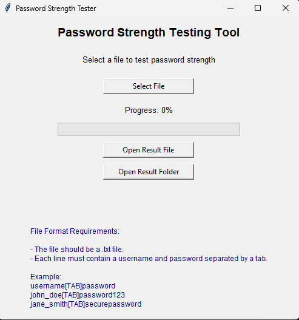

# Password Strength Testing Tool

## Overview

This Python-based application is designed to test the strength of passwords using the **zxcvbn** password strength estimator. It provides a simple graphical user interface (GUI) that allows users to upload a text file containing usernames and passwords, then evaluates the strength of each password and generates a result file with the output.

The application includes the following features:
- Automatic dependency installation if missing (i.e., `zxcvbn`).
- A clean and simple GUI interface for selecting files.
- Real-time progress tracking with a progress bar.
- Generation of a result file (`results.txt`) that lists usernames, passwords, and their corresponding strength scores.
- Options to open the result file or the folder containing the file at the end of the process.

## How It Works

### Input File Format

The input file should be a **tab-separated text file** (`.txt`), where each line contains two fields:
- **Username**: The first field is the username.
- **Password**: The second field is the password.

Each username and password should be separated by a tab (`\t`).

## Screenshot - Application GUI

### Features

1. **Dependency Handling**: 
   - The application automatically checks for the presence of the required library `zxcvbn`. If it is not installed, it will be installed automatically.
   
2. **Graphical User Interface (GUI)**:
   - Built using `Tkinter`, the GUI allows users to select their password file through a file dialog, eliminating the need to edit the script to change file inputs.
   - The GUI displays a progress bar that tracks the completion percentage of the file processing.
   
3. **Password Strength Calculation**:
   - Each password is evaluated using the `zxcvbn` library, which provides a strength score from 0 (very weak) to 4 (very strong).
   - These scores are written to an output file (`results.txt`), along with the corresponding username and password.

4. **Progress Tracking**:
   - A progress bar updates in real time as the file is processed, showing the percentage of the completed work.
   
5. **Result File and Folder Access**:
   - After processing, the user is presented with two buttons: one to open the result file (`results.txt`), and another to open the folder containing the file.

### Output

The results of the password strength analysis are written to a file called `results.txt`. Each entry in the file will follow the structure:

The password strength is evaluated using the following scoring system:
- **0**: Very weak
- **1**: Weak
- **2**: Moderate
- **3**: Strong
- **4**: Very strong

### Installation & Requirements

This application is built using Python and requires the following libraries:
- `zxcvbn`
- `Tkinter` (usually included with standard Python installations)

The application automatically installs any missing dependencies.

### Usage

1. Clone or download this repository.
2. Run the script `password_strength_tester.py`.
3. In the GUI window, select the input file (a tab-separated `.txt` file).
4. The script will process the file and display the progress.
5. Once completed, you can view the result file or the folder containing the result.
